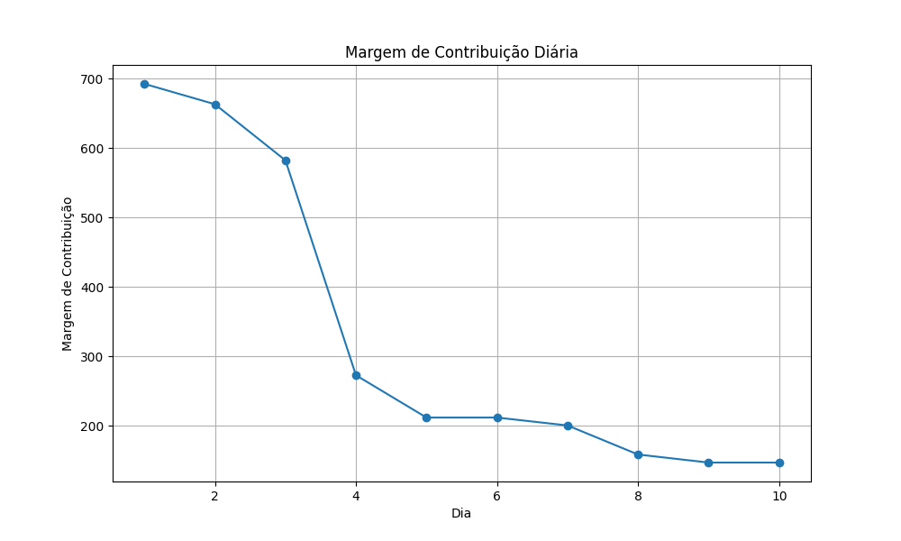
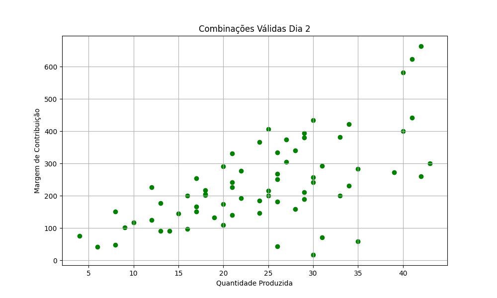
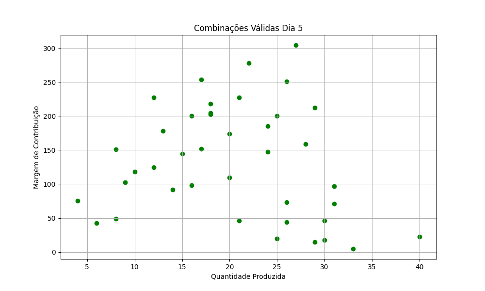
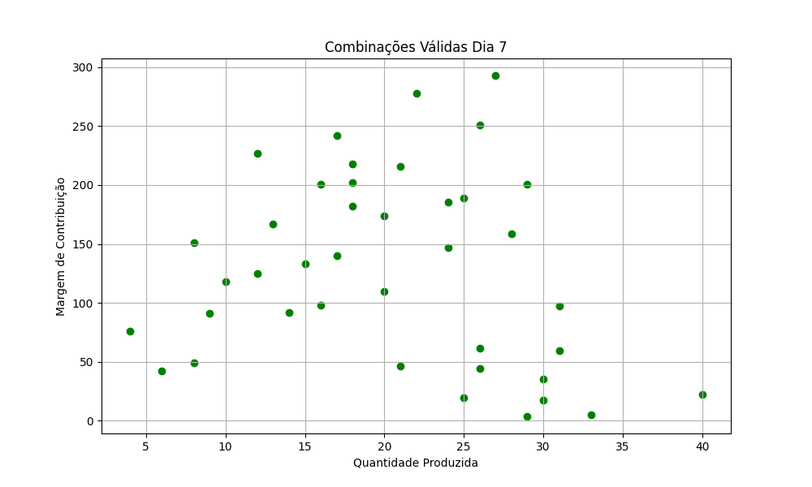
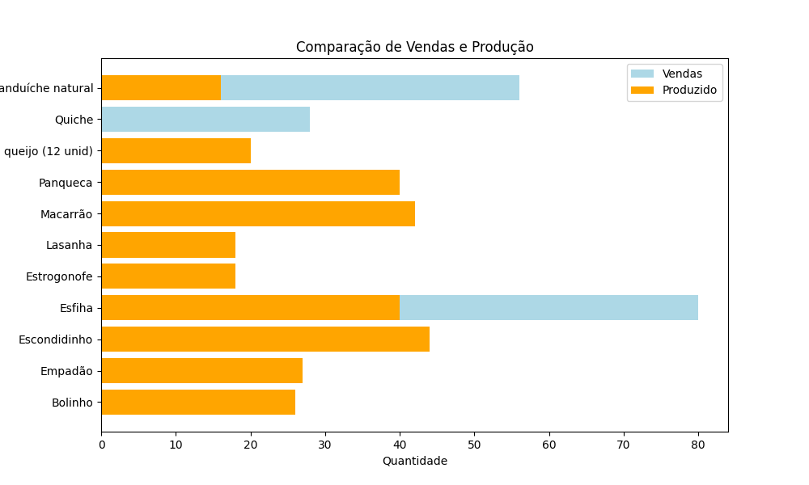
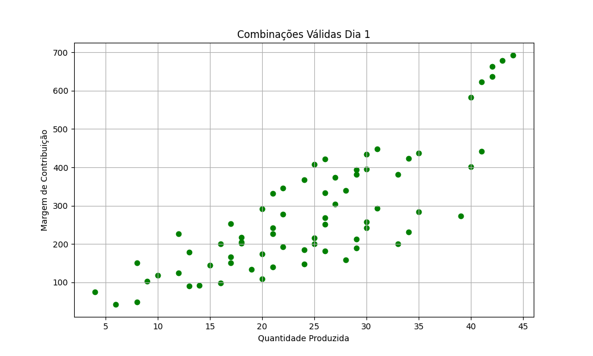
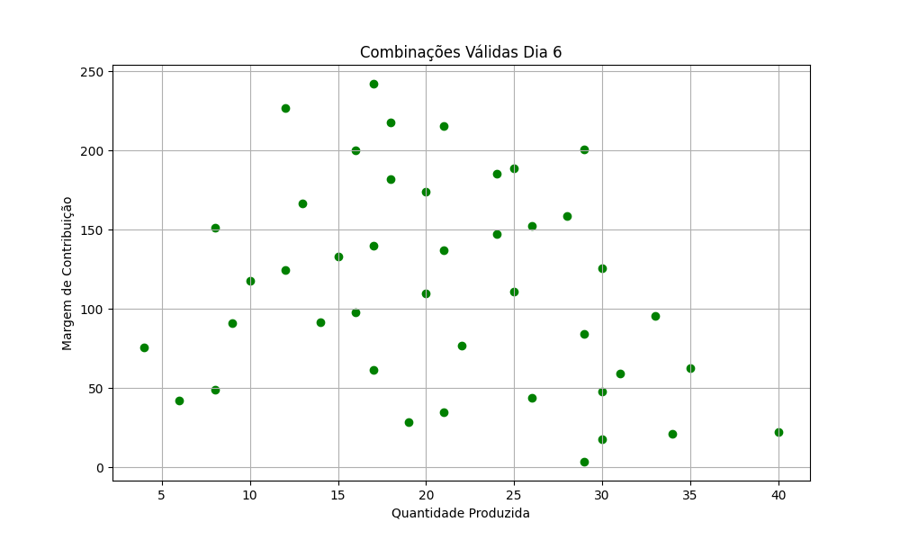
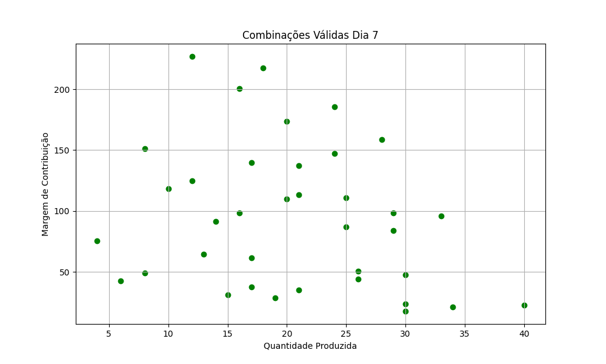
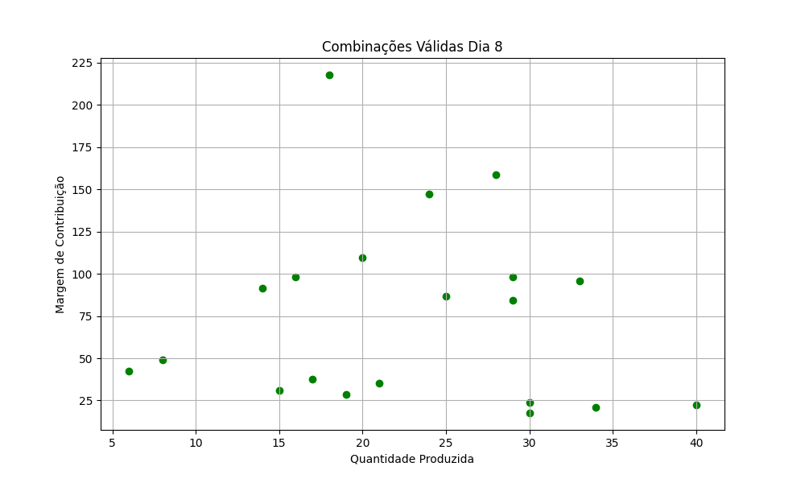
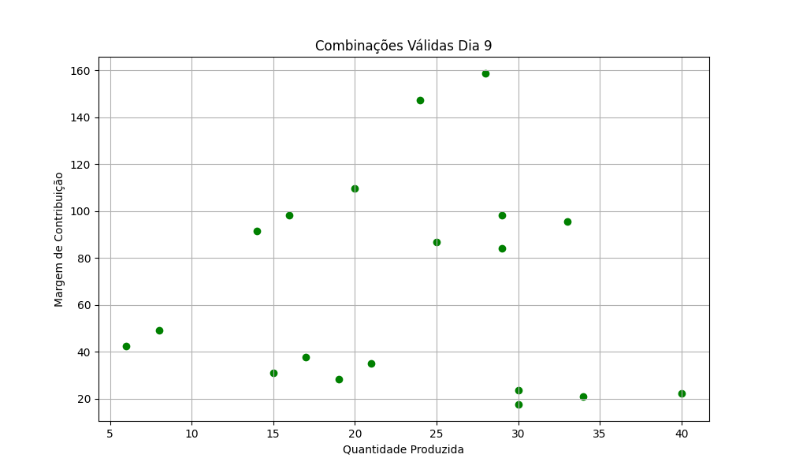

# Projeto de Otimização de Produção

## Visão Geral
Este projeto implementa um script em Python para otimizar a produção de uma empresa, visando a maximização da margem de contribuição dos produtos, considerando as restrições de tempo de produção e demanda de vendas.

## Estratégias de Otimização

### Foco Misto
O "Foco Misto" balanceia entre maximizar a margem de contribuição e atender à demanda de vendas. Esta abordagem busca alcançar um ponto ótimo onde a empresa pode aumentar os lucros enquanto satisfaz as necessidades do mercado, garantindo uma operação mais sustentável e balanceada.

### Maximização da Margem de Contribuição
A estratégia de "Maximização da Margem de Contribuição" concentra-se em aumentar os lucros através da maximização da margem de contribuição por produto, mesmo que isso possa resultar em não atender completamente à demanda de vendas. Prioriza a produção de itens com maior retorno financeiro por unidade.

## Implementação e Processo

1. **Carregamento e Preparação dos Dados:**
   - Carrega os dados de produção dos produtos de um arquivo CSV.
   - Converte os valores monetários e o tempo de produção para formatos numéricos.

2. **Geração de Combinações de Produção:**
   - Utiliza combinações para gerar todas as possíveis sequências de produção diárias, considerando o limite de tempo de produção.

3. **Análise e Seleção das Combinações:**
   - Avalia cada combinação de produção com base na margem total de contribuição.
   - Seleciona a melhor combinação para cada dia de produção.

4. **Exportação dos Resultados e Análise Comparativa:**
   - Salva as combinações de produção e as margens de contribuição em arquivos Excel.
   - Realiza uma análise comparativa entre as vendas previstas e a produção realizada.

5. **Visualização dos Dados:**
   - Gera gráficos para ilustrar a margem de contribuição diária e comparar as vendas com a produção.

# Foco Misto

O código é um script em Python projetado para maximizar a margem de contribuição da produção de uma série de produtos ao longo de um período de dez dias, respeitando restrições de tempo de produção diária e demanda de vendas para cada produto. O processo utiliza uma abordagem de otimização combinatória, não linear, para encontrar as melhores combinações de produção diária. Aqui está uma descrição detalhada de cada parte do código:

## Importação de Bibliotecas:

pandas é usado para manipular e analisar os dados do arquivo CSV.
itertools fornece a função combinations_with_replacement que é usada para gerar todas as combinações possíveis de produtos para a produção diária.
matplotlib.pyplot é usada para criar gráficos visuais das margens de contribuição diária e da comparação entre vendas e produção.
Carregamento de Dados:
O script começa carregando os dados dos produtos de um arquivo CSV. Esses dados incluem informações como a margem de contribuição por unidade, o tempo necessário para produzir cada produto e as vendas previstas para duas semanas.

## Processamento de Dados:

As margens de contribuição são convertidas de texto para valores numéricos flutuantes.
O tempo de produção é convertido de uma string de hora para minutos para facilitar os cálculos subsequentes.
Definição de Parâmetros:
O tempo máximo de produção diário é estabelecido em 300 minutos (5 horas), e o período de produção é definido para 10 dias.

## Geração e Avaliação de Combinações:

O script gera todas as combinações possíveis de produção de produtos para cada dia, considerando o tempo de produção disponível.
Para cada combinação, calcula-se a margem total de contribuição e verifica-se se a combinação pode ser produzida dentro do limite de tempo diário.
As combinações que maximizam a margem de contribuição enquanto atendem às restrições de tempo são priorizadas.
Seleção das Melhores Combinações:
Para cada dia, é selecionada a combinação de produção que oferece a maior margem de contribuição total, dentro do limite de tempo disponível, e as quantidades produzidas são subtraídas da demanda restante.

## Exportação dos Resultados:
Os dados das combinações válidas e das escolhas diárias são salvos em arquivos Excel para análise e registro.

## Análise e Visualização de Dados:
O script compara as vendas previstas em duas semanas com a produção realizada e gera gráficos para ilustrar a margem de contribuição diária e a comparação entre as vendas e a produção.

Este script oferece uma visão detalhada de como otimizar a produção para maximizar as margens de contribuição, levando em consideração as limitações de tempo e a demanda de vendas. Ele utiliza uma abordagem detalhada que considera todas as possíveis combinações de produção para identificar aquelas que maximizam a margem de contribuição.

## Resultados

### Margem de contribuição diária

### Comparação das vendas x produção

### Combinações possíveis durante os 10 dias

#
# Foco Máxima em Margem de Contribuição

O código em questão executa uma análise de otimização de produção para uma empresa que fabrica diversos produtos. O objetivo é maximizar a margem de contribuição total em um período de 10 dias, respeitando as limitações de tempo de produção diário e atendendo à demanda de vendas prevista para cada produto. Aqui está um resumo detalhado de cada etapa do processo:

## Carregamento de Dados:
 Os dados dos produtos são carregados de um arquivo CSV. Esses dados incluem o nome do produto, a margem de contribuição por unidade, o tempo necessário para produzir cada unidade e a demanda de vendas para as próximas duas semanas.

## Preparação de Dados:

convert_currency_to_float: Converte strings de valores monetários em formato brasileiro para números de ponto flutuante.
convert_time_to_minutes: Converte strings de tempo no formato "horas:minutos:segundos" para o total de minutos.
Definição de Parâmetros:

tempo_maximo_diario é definido como 300 minutos (5 horas), representando o tempo máximo disponível para produção em um único dia.
dias_de_producao é definido como 10 dias, indicando o período de tempo total considerado para a análise.
Processo de Otimização:

Para cada dia, o código gera todas as combinações possíveis de produção dos produtos, considerando o limite de tempo de produção diário.
Para cada combinação, é calculada a margem total de contribuição, somando a margem de contribuição de cada produto multiplicada pela quantidade que pode ser vendida.
A melhor combinação para cada dia é aquela que gera a maior margem total de contribuição sem exceder o tempo de produção disponível.
Seleção e Registro das Combinações Ótimas:

As melhores combinações são selecionadas e armazenadas, juntamente com as margens de contribuição diárias correspondentes.
A demanda restante de cada produto é ajustada com base na quantidade produzida.
## Exportação de Dados:

As combinações de produção diárias e suas respectivas margens de contribuição são exportadas para arquivos Excel para análise posterior.
Análise Comparativa:

Uma comparação entre as vendas previstas para duas semanas e a quantidade produzida é realizada para avaliar o desempenho da produção em relação às metas de vendas.

## Visualização de Dados:

Gráficos são gerados para visualizar a margem de contribuição diária, a comparação entre vendas e produção, e as combinações válidas de produção para cada dia.
Este código aborda um problema de otimização de produção complexo de maneira iterativa e heurística, buscando combinações que maximizem a margem de contribuição enquanto atendem às restrições operacionais e de mercado.

## Resultados

### Margem de contribuição diária

### Comparação das vendas x produção

### Combinações possíveis durante os 10 dias

# O porque não foi escolhido o Método do Simplex

O método Simplex é amplamente reconhecido por sua eficiência em resolver problemas de programação linear, focando na otimização de sistemas com variáveis contínuas e restrições lineares. No entanto, para o projeto de otimização de produção em questão, o Simplex não foi escolhido devido a várias razões intrínsecas à natureza do problema e aos objetivos específicos desejados:

1. **Complexidade Combinatória e Discretização:**
   O problema de otimização de produção aqui não é apenas linear, mas profundamente combinatório e requer decisões discretas (por exemplo, a quantidade de produção de cada produto é um número inteiro, não fracionário). O Simplex é ideal para problemas lineares contínuos e não se adapta bem a situações onde é necessário considerar todas as combinações possíveis para encontrar a melhor solução.

2. **Limitações com Restrições Dinâmicas:**
   As restrições de tempo de produção e demanda de vendas variam diariamente e dependem das decisões tomadas nos dias anteriores. Esta dinâmica temporal complexa introduz uma dimensão sequencial no problema, que está além da capacidade de modelagem linear estática do Simplex.

3. **Precisão na Solução:**
   O método de força bruta, apesar de ser mais intensivo computacionalmente, garante a avaliação de todas as combinações possíveis, assegurando que a solução encontrada seja o ótimo global. O Simplex, por sua vez, pode não ser capaz de identificar a melhor solução global em um ambiente com tantas variáveis discretas e restrições interdependentes.

4. **Especificidade das Restrições do Negócio:**
   O projeto necessita de uma solução que respeite estritamente as restrições específicas de produção e vendas de cada produto. A abordagem de força bruta permite uma modelagem mais direta e específica dessas restrições, enquanto o Simplex exigiria uma simplificação ou generalização que poderia comprometer a precisão e a relevância dos resultados.

5. **Dificuldade em Modelagem e Solução Linear:**
   Transformar o problema em um modelo linear adequado para o Simplex seria extremamente complexo e talvez inviável devido à quantidade de variáveis, restrições não lineares e a necessidade de soluções inteiras, o que poderia resultar em uma modelagem imprecisa ou uma solução subótima.

Em resumo, a escolha do método de força bruta foi determinada pela necessidade de uma solução que pudesse abranger totalmente a complexidade, a especificidade e as dinâmicas do problema de otimização de produção. Embora o Simplex seja uma ferramenta poderosa em muitos contextos, neste caso, ele não seria capaz de fornecer a flexibilidade, a precisão e a abrangência necessárias para atingir os objetivos do projeto com eficácia.

# Créditos
Este projeto foi desenvolvido por Guilherme Cagide Fialho. 

## Conclusão
Este projeto fornece insights valiosos para a tomada de decisão na produção, permitindo à empresa otimizar suas operações para maximizar os lucros e atender à demanda do mercado de forma equilibrada.
